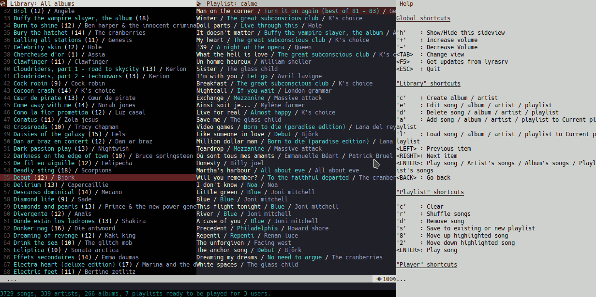

# 💿 Lyra

⚠ *Right now Lyra is in an alpha stage.*

Lyra is a self-hosted *opinionated* music server.



Its main purpose is to meet these objectives :

1. To manage songs and playlists on a self-hosted server.
2. To keep song and playlist files on different clients synced with server content.
3. To avoid playlists being broken updating song's name, album's name, artist's name or reorganizing song files hierarchy.
4. Not to impose a particular music player to listen your music (thanks to the files sync).
5. To be easy to
    1. Install (statically compiled)
    2. Backup (embedded database)
    3. Secure (https by default)
6. To be multiplatform (different OS or Architecture: Windows/Mac/Linux/Raspbian)

Lyra is a free and open source project distributed under the permissive Apache 2.0 License. 

## Table of Contents
- [Opinionated](#opinionated)
- [Lyra server](#lyra-server)
  - [Installation](#installation)
  - [Usage](#usage)
  - [Where is my data stored ?](#where-is-my-data-stored-)
  - [Auto start and stop lyra server with systemd on linux](#auto-start-and-stop-lyra-server-with-systemd-on-linux)
- [Lyra client](#lyra-client)
  - [Installation](#installation-1)
  - [Usage](#usage-1)

### Opinionated

This software doesn’t try to satisfy the needs of everyone.

- The number of features is voluntarily limited to facilitate its maintenance.
- Only **flac** and **mp3** formats are supported (**ogg** may come later).
- When you import some music on lyra server, **song filenames are ignored**, only tags are used to link your song to an artist, an album or to known the song name.
- Once your music is imported, **song tags are partially managed by lyra server** and are used to generate song filename on lyra clients.
- **Only one-way sync is supported**:  song files and playlists are copied from lyra server to lyra clients.
- Homonym artists and albums are differentiated.
- Each song can be linked to **multiple artists** but only one album.

## Lyra server

### Installation

#### From prebuild binaries

Drop the dedicated `lyrasrv` binary on your server and you are done.

#### From sources

You need golang >= 1.13

```
go install lyra/cmd/lyrasrv
```

### Usage

#### Run

```
lyrasrv run
```

Use Ctrl+C to gracefully stop it.

On first launch, `lyrasrv run` will:
- Create default admin user with lyracli/lyracli as username/password
- Create a self-signed certificate valid for localhost only
- Listen client requests on https://localhost:6620

#### Configuration

If you want to access your server from both https://mypersonaldomain.org:6630 and https://77.77.77.77:6630, you should configure lyrasrv accordingly with:

```
lyrasrv config -hostnames mypersonaldomain.org,77.77.77.77 -n 6630 -enable-ssl
```

#### More options

Run 

```
lyrasrv --help
lyrasrv <COMMAND> --help
```

for more informations

### Where is my data stored ?

Configuration file, embedded database, song and cover files are all saved into **lyrasrv** config folder: 

- `$HOME/.config/lyrasrv` on linux
- `%LocalAppData%\lyrasrv` on windows
- `$HOME/Library/Application Support/lyrasrv` on mac

#### Backup data

- Stop lyra server
- Backup **lyrasrv** config folder content
- Start lyra server

#### Restore data

- Stop lyra server
- Replace **lyrasrv** config folder with content from your last backup
- Start lyra server

### Auto start and stop lyra server with systemd on linux

- Copy `lyrasrv` to `/usr/bin`
- Create systemd service file

    ```
    sudo touch /etc/systemd/system/lyrasrv.service
    sudo chmod 664 /etc/systemd/system/lyrasrv.service
    ```

- Edit /etc/systemd/system/lyrasrv.service

    ```
    [Unit]
    Description=Lyra server
    
    [Service]
    Type=simple
    Restart=on-failure
    ExecStart=/usr/bin/lyrasrv run
    User=myuser
    Group=myuser
    
    [Install]
    WantedBy=multi-user.target
    ```

- Enable & start lyra server

    ```
    sudo systemctl daemon-reload
    sudo systemctl enable lyrasrv.service
    sudo systemctl start lyrasrv.service
    ```
    
## Lyra client

### Installation

#### From prebuild binaries

Drop the dedicated `lyracli` binary on your client.

#### From sources

You need golang >= 1.13 and
- `libasound2-dev` on linux
- `mingw-w64` on windows
- `AudioToolbox.framework` on mac

```
go install lyra/cmd/lyracli
```

### Usage

#### Configuration

On first launch, *lyracli* try to connect to lyra server using https://localhost:6620
(only accepting server self-signed certificate read on first connection) with lyracli/lyracli as username/password.

You can change default configuration with:

```
lyracli config -hostname <HOSTNAME> -n 6620 -u lyra -p lyra
```

NB: \<HOSTNAME\> should match with one of the hostnames configured on lyra server.

#### Import music folder content to lyra server

```
lyracli import [Location of music folder to import]
```

*lyracli* will recursively loop through specified folder to import every .flac and .mp3 files to lyra server.

#### Sync local music folder content with lyra server

Prepare local music folder (one-time):
```
lyracli filesync init [Location of folder to synchronize]
```

Launch synchronization:
```
lyracli filesync sync [Location of folder to synchronize]
```

#### Console user interface

Run console user interface to manage and listen lyra server content:

```
lyracli ui
```

Press `H` to display available shortcuts to navigate through the interface.

NB: After a fresh server installation, use the console user interface to change your default username/password.

#### More options

Run 

```
lyracli --help
lyracli <COMMAND> --help
lyracli <COMMAND> <SUBCOMMAND> --help
```

for more informations.
