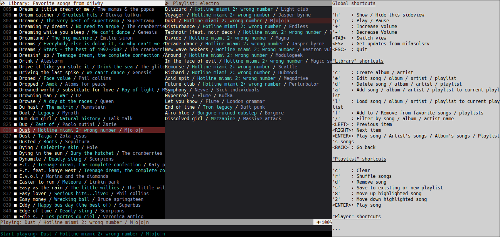

# 💿 Mifasol

⚠ *Right now Mifasol is in an alpha stage.*

Mifasol is a self-hosted *opinionated* music server.



## Key features

1. Songs and playlists management on a self-hosted server for multiple users.
2. Keeping favorite song and playlist files synced with server content on different clients.
3. Differentiation of homonym artists and albums.
4. Song can be linked to more than one artist.
5. Avoiding playlists being broken updating song's name, album's name, artist's name or reorganizing song files hierarchy.
6. No requirements about music player used to listen your music (thanks to the files sync).
7. Server is easy to
    1. Install (one executable file to copy and you are done)
    2. Backup (all data in one folder)
    3. Secure (https by default, no certificate authentication required)
8. Blazing fast navigation with console user interface
9. Multiplatform (different OS or Architecture: Windows/Mac/Linux/Raspbian/Synology)
10. REST API for those who want to develop their own client.

Mifasol is a free and open source project distributed under the permissive Apache 2.0 License. 

## Table of Contents
- [Opinionated](#opinionated)
- [Mifasol server](#mifasol-server)
  - [Installation](#installation)
  - [Usage](#usage)
  - [Where is my data stored ?](#where-is-my-data-stored-)
  - [Auto start and stop mifasol server with systemd on linux](#auto-start-and-stop-mifasol-server-with-systemd-on-linux)
- [Mifasol client](#mifasol-client)
  - [Installation](#installation-1)
  - [Usage](#usage-1)

### Opinionated

This software doesn’t try to satisfy the needs of everyone.

- The number of features is voluntarily limited to facilitate its maintenance.
- Only **flac** and **mp3** formats are supported (**ogg** may come later).
- When you import some music on mifasol server, **song filenames are ignored**, only tags are used to link your song to an artist, an album or to known the song name.
- Once your music is imported, **song tags are partially managed by mifasol server** and are used to generate song filename on mifasol clients.
- **Only one-way sync is supported**:  song files and playlists are copied from mifasol server to mifasol clients.
- Even though mifasol client is able to play music, his development is more focused on music library management and its synchonization than on music streaming.

## Mifasol server

### Installation

#### From prebuild binaries

Drop the dedicated `mifasolsrv` binary on your server and you are done.

#### From sources

You need golang >= 1.13

```
go install mifasol/cmd/mifasolsrv
```

### Usage

#### Run

```
mifasolsrv run
```

Use Ctrl+C to gracefully stop it (and to avoid database corruption).

On first launch, `mifasolsrv run` will:
- Create default admin user with mifasol/mifasol as username/password
- Create a self-signed certificate valid for localhost only
- Listen client requests on https://localhost:6620

#### Configuration

If you want to access your server with those external urls: https://mypersonaldomain.org:6630 and https://77.77.77.77:6630, you should configure mifasolsrv accordingly with:

```
mifasolsrv config -hostnames mypersonaldomain.org,77.77.77.77 -n 6630 -enable-ssl
```

#### More options

Run 

```
mifasolsrv --help
mifasolsrv <COMMAND> --help
```

for more informations

### Where is my data stored ?

Configuration file, embedded database, song and cover files are all saved into **mifasolsrv** config folder: 

- `$HOME/.config/mifasolsrv` on linux
- `%LocalAppData%\mifasolsrv` on windows
- `$HOME/Library/Application Support/mifasolsrv` on mac

#### Backup data

- Stop mifasol server
- Backup **mifasolsrv** config folder content
- Start mifasol server

#### Restore data

- Stop mifasol server
- Replace **mifasolsrv** config folder with content from your last backup
- Start mifasol server

### Auto start and stop mifasol server with systemd on linux

- Copy `mifasolsrv` to `/usr/bin`
- Create systemd service file

    ```
    sudo touch /etc/systemd/system/mifasolsrv.service
    sudo chmod 664 /etc/systemd/system/mifasolsrv.service
    ```

- Edit /etc/systemd/system/mifasolsrv.service

    ```
    [Unit]
    Description=Mifasol server
    
    [Service]
    Type=simple
    Restart=on-failure
    ExecStart=/usr/bin/mifasolsrv run
    User=myuser
    Group=myuser
    
    [Install]
    WantedBy=multi-user.target
    ```

- Enable & start mifasol server

    ```
    sudo systemctl daemon-reload
    sudo systemctl enable mifasolsrv.service
    sudo systemctl start mifasolsrv.service
    ```
    
## Mifasol client

### Installation

#### From prebuild binaries

Drop the dedicated `mifasolcli` binary on your client.

#### From sources

You need golang >= 1.13 and
- `libasound2-dev` on linux
- `mingw-w64` on windows
- `AudioToolbox.framework` on mac

```
go install mifasol/cmd/mifasolcli
```

### Usage

#### Configuration

On first launch, *mifasolcli* try to connect to mifasol server using https://localhost:6620
(only accepting server self-signed certificate read on first connection) with mifasol/mifasol as username/password.

You can change default configuration with:

```
mifasolcli config -hostname <HOSTNAME> -n 6620 -u mifasol -p mifasol
```

NB: \<HOSTNAME\> should match with one of the hostnames configured on mifasol server.

#### Import music folder content to mifasol server

```
mifasolcli import [Location of music folder to import]
```

*mifasolcli* will recursively loop through specified folder to import every .flac and .mp3 files to mifasol server.

#### Sync local music folder with mifasol server's user favorite content

Prepare local music folder (one-time):
```
mifasolcli filesync init [Location of folder to synchronize]
```

Launch synchronization:
```
mifasolcli filesync sync [Location of folder to synchronize]
```

#### Console user interface

Run console user interface to manage and listen mifasol server content:

```
mifasolcli ui
```

Press `h` to display available shortcuts to navigate through the interface.

##### Tips:
- **After a fresh server installation, use the console user interface to change the default username/password**.
- Windows users should use new *Windows Terminal* to correctly display unicode emojis.  

#### More options

Run 

```
mifasolcli --help
mifasolcli <COMMAND> --help
mifasolcli <COMMAND> <SUBCOMMAND> --help
```

for more informations.
